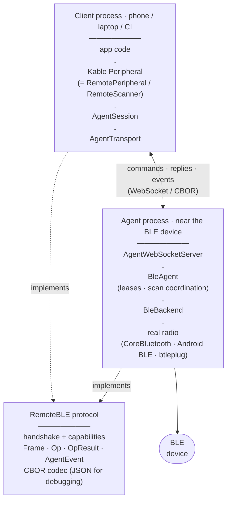

# RemoteBLE

[](https://github.com/Yahia-Mohammad/remote-ble/actions/workflows/build.yml)
[](https://central.sonatype.com/artifact/dev.warsha.remoteble/client-sdk)
[](https://github.com/Yahia-Mohammad/remote-ble/releases/latest)
[](LICENSE)

RemoteBLE operates Bluetooth Low Energy devices across a network: an **agent** near the device
owns the physical radio, and a **client** drives it over an IP link. With the bundled Kotlin
Multiplatform **client SDK**, app code written against
[Kable](https://github.com/JuulLabs/kable)'s `Peripheral` runs **unchanged** whether the
peripheral is physically local or remote. The two sides meet on a versioned,
capability-negotiated **protocol** — specified normatively in the
[conformance spec](docs/agent-conformance-spec.md), implemented independently in Kotlin and
Rust, and interop-tested against the exact CBOR on the wire. Not affiliated with JUUL Labs or
the Kable project.

Inspired by [ESPHome's Bluetooth Proxy](https://esphome.io/components/bluetooth_proxy/),
which pioneered relaying the full BLE/GATT surface over IP behind the host BLE library's own
interface (Bleak + Home Assistant there, Kable here) — RemoteBLE applies the same idea to
Kotlin Multiplatform and OS-class hosts for development, testing, and CI. Independent and
not affiliated with the ESPHome or Home Assistant projects.

## Quick look

Start an agent once (see [Running the agent](#running-the-agent) for every option):

```sh
agent/run-agent.sh 8080   # ws://localhost:8080/agent, real CoreBluetooth/BlueZ/…
```

Then it's ordinary Kable code — the only RemoteBLE-specific part is how you get the
`Peripheral`:

```kotlin
val scope = CoroutineScope(SupervisorJob() + Dispatchers.Default)
val transport = WebSocketAgentTransport("ws://localhost:8080/agent", scope, defaultWebSocketHttpClient())
val session = DefaultAgentSession(transport, CborProtocolCodec(), scope)

// scan → pick a device → get a Kable Peripheral that happens to be remote
val advertisement = RemoteScanner(session).advertisements.first()
val peripheral = peripheralFor(BleMode.REMOTE, advertisement, session)

// from here it's just Kable — identical to a local Peripheral
peripheral.connect()
val characteristic = peripheral.services.first()!!.first().characteristics.first()
val value = peripheral.read(characteristic)
peripheral.observe(characteristic).collect { /* notifications */ }
```

Swap `BleMode.REMOTE` for `BleMode.LOCAL` (and drop the `session`) and the exact same
`peripheral` code runs against the local radio instead — that one-line factory choice is
the whole point of RemoteBLE. Full walkthrough with expected output at every step in
[getting-started.md](docs/getting-started.md); every public class in
[client-sdk.md](docs/client-sdk.md).

## System at a glance

RemoteBLE has three core parts:

1. **Protocol** — the implementation-independent wire contract: handshake, capabilities,
   commands, replies, events, errors, and CBOR/JSON codecs. It has no BLE or networking code.
2. **Agent** — the radio-side service that implements the protocol, arbitrates access to
   peripherals, and maps protocol operations onto a real or simulated BLE backend. The repository
   contains interoperable Kotlin and Rust agents.
3. **Client SDK** — the bundled Kotlin Multiplatform client implementation: transport, session,
   reconnection, GATT/scanning operations, and Kable-compatible adapters.

The protocol is the interoperability boundary: agents and clients never depend on each other in
production — they meet on the wire. What each side must do is normative in
[docs/agent-conformance-spec.md](docs/agent-conformance-spec.md), and
[`RustAgentInteropTest`](protocol/src/commonTest/kotlin/dev/warsha/remoteble/protocol/RustAgentInteropTest.kt)
pins the exact CBOR the Rust agent emits and proves the Kotlin side decodes it. Kable is a
public integration surface of the bundled client SDK, and an internal radio engine of the
Kotlin agent.

## Installation

The client SDK is published to **Maven Central** as `dev.warsha.remoteble:client-sdk`
(Kotlin Multiplatform: JVM, Android, iOS). It pulls `:protocol` and Kable transitively.

```kotlin
// build.gradle.kts — commonMain for a KMP app, or a JVM/Android source set
dependencies {
    implementation("dev.warsha.remoteble:client-sdk:0.11.0")
}
```

> The snippet tracks the current release line. The **Maven Central badge at the top of this
> README shows the version actually resolvable right now** — if you're reading between a version
> bump and its Central publish, use that number.

Upgrading? Read the concise [0.11.0 migration guide](docs/migrate-to-0.11.0.md) — no source
change is required, but two agent defaults move. Coming from a release older than 0.10.0, start with
the [0.10.0 guide](docs/migrate-to-0.10.0.md) and its breaking `authToken` provider change.

**iOS** is covered by the same coordinate: it's a Kotlin Multiplatform publication, so an
iOS app that shares Kotlin code (your Kable app logic lives in `commonMain`) resolves the
`iosArm64`/`iosSimulatorArm64` klibs from Central automatically. There is no separate
Swift Package / XCFramework — this SDK is consumed as Kotlin, alongside Kable itself.

The **agent** is run from a prebuilt binary ([download from a release](https://github.com/Yahia-Mohammad/remote-ble/releases/latest))
or from source (`agent/run-agent.sh`, the `agent-rs` binary, or the phone apps), not consumed as a
dependency — see [Running the agent](#running-the-agent).

## Use cases

- **Test Kable BLE apps in the Android emulator / iOS simulator** — neither has a Bluetooth radio,
  so point the app at an agent on a machine that does and scan/connect/read/write/observe as if local.
- **Run BLE integration tests in CI** — a headless job (or self-hosted runner) with no radio drives
  real hardware on a lab machine; `:e2e-runner` is built for exactly this.
- **Access remote BLE hardware** — drive a device beside another machine (a lab rig, a Raspberry Pi)
  from your laptop or CI over the network.
- **Coordinate one BLE device across a team** — the agent leases a peripheral exclusively to one
  client at a time so several people can take turns without colliding. Shared mode is disabled for
  0.9.0 pending a participant model.
- **Add remote access to an existing local BLE system** — local-vs-remote is a factory choice
  (`peripheralFor(mode, …)`), so Kable code gains it with essentially no rewrite.

## Features

- **Minimal changes for Kable apps** — remote is a construction choice, not an app-code change (proven by `KableAdapterTest`).
- **Multiplatform** — client on JVM/Android/iOS; agents on macOS/Linux (JVM *or* native Rust), Android, and iOS.
- **Lightweight agent** — one self-bootstrapping script to run; the Rust agent is a single native binary, and phones run it from an app.
- **Full GATT surface over the wire** — scan, connect, discover, read, write, observe (notify), descriptors, MTU, pairing, connection priority, connection slots, batched scan.
- **Multi-client with exclusive peripheral ownership** — one agent serves many clients; each
  peripheral is leased to one client at a time and ownership resumes across brief reconnects.
- **Resilient by design** — reconcile-on-reconnect (auto-replays connections / subscriptions / scans), per-op-class timeouts, and WebSocket liveness pings.
- **Transport-agnostic** — the transport seam is a plain byte pipe; WebSocket today, raw TCP or a cloud relay drop in without touching the session or BLE layers.
- **Two agents, one wire contract** — a Kotlin/Kable and a native Rust/`btleplug` agent, both speaking the same versioned, capability-negotiated **CBOR** protocol (JSON for debugging), interop-tested.
- **Optional bearer-token auth** at the handshake, plus an optional status dashboard protected by a separate operator credential (native Compose UI on the phone agents).

## How the system works

In **remote** mode, `RemotePeripheral`/`RemoteScanner` implement Kable's own `Peripheral`/
`Scanner` interfaces, but forward every call over an IP link to an **agent** process near the
physical device, which drives the real radio and streams results/events back:



In **local** mode the client bypasses the RemoteBLE protocol and agent: ordinary Kable talks to
the radio on the same device. Switching modes is a factory choice (`peripheralFor(mode, …)`), not
an app-code change. See [docs/README.md](docs/README.md#architecture) for the full system and
component architecture.

📖 **Docs:** new to this? Start with the [**getting-started tutorial**](docs/getting-started.md).
Full implementation reference (APIs, internals, rationale) in [`docs/`](docs/README.md) —
architecture, [protocol](docs/protocol.md), [client SDK](docs/client-sdk.md),
[agent](docs/agent.md), [end-to-end flows + sequence diagrams](docs/flows.md),
[design rationale](docs/design-decisions.md), [build & testing](docs/build-and-testing.md).

Release scope is tracked in [`docs/proposals/0.10.0-scope.md`](docs/proposals/0.10.0-scope.md),
which covers radio-less CI, the Rust-agent container, deferred validation, and the consolidated
Maven Central release; the [CHANGELOG](CHANGELOG.md) is the shipped history and
[`docs/proposals/0.9.1-hardening-decisions.md`](docs/proposals/0.9.1-hardening-decisions.md) records
the accepted security/lifecycle hardening. The future
[AgentProxy design](docs/proposals/agent-proxy.md) is explicitly outside the 0.10.0 release.

## Modules

| Module | Role | Deps |
|---|---|---|
| `:log` | Shared multiplatform logging facade used across the Kotlin components | No external dependencies. Targets: JVM + Android + iOS |
| `:protocol` | The wire contract (`Frame`/`Op`/`OpResult`/`AgentEvent`) + CBOR/JSON codec | kotlinx-serialization only — **no BLE/network**. Targets: JVM + Android + iOS |
| `:client-sdk` | Session, transport, `RemotePeripheral`/`RemoteScanner` | `:protocol`, `:log`, coroutines, Kable. Targets: JVM (tests) + Android + iOS |
| `:agent` | Remote Bluetooth agent (Kotlin) + live status dashboard + a Compose Multiplatform status UI (Android/iOS). Run via `agent/run-agent.sh` (JVM) or the `android-agent`/`ios-agent` apps | `:protocol`, `:log`, coroutines, Ktor server, Kable, Compose Multiplatform. Targets: JVM + Android + iOS |
| `agent-rs` | Native cross-platform Bluetooth agent (Rust 2024). Run via the self-bootstrapping `run-agent-rs.sh` | tokio, tokio-tungstenite, btleplug, serde/ciborium. Targets: macOS + Linux |
| `:e2e-runner` | Live E2E runner (`jvmRun`) + radio-less scan smoke test (`scanRun`) | `:client-sdk` (JVM). See [README](e2e-runner/README.md) |
| `:client-ui` | The central demo's UI (`RemoteBleApp`: `ScanScreen`/`DeviceScreen`) + orchestration (`RemoteBleController`) — Compose Multiplatform, shared by `:android-client` and `ios-client/` | `:client-sdk`. Targets: Android (library) + iOS |
| `:android-client` | Thin Android app shell around `:client-ui`: scans through the host agent over `ws://10.0.2.2:8080/agent` (no radio, `INTERNET` only) | `:client-ui` |
| `ios-client/` | Thin, logic-free XcodeGen launcher shell for `:client-ui`'s iOS target (standalone Xcode project, **not** a Gradle module) | `:client-ui`'s exported `RemoteBleClient.xcframework`. See [README](ios-client/README.md) |
| `:android-agent` | Thin Android app shell around `:agent`'s androidTarget: runs the real agent (BLE central + WebSocket server + dashboard) on the phone's own radio, in a foreground service | `:agent` |
| `ios-agent/` | Thin, logic-free XcodeGen launcher shell for `:agent`'s iOS target (standalone Xcode project, **not** a Gradle module) | `:agent`'s exported `RemoteBleAgent.xcframework`. See [README](ios-agent/README.md) |

> **You'll need a test peripheral for the full connect/read/write/observe path.** Any GATT
> peripheral works — a Heart Rate / Battery advertiser for the demo UI, or your own app with custom
> UUIDs for the raw op-set. See [`docs/bringup.md`](docs/bringup.md) for a scripted
> live bring-up.

## Pinned versions

| | Version |
|---|---|
| Kotlin | 2.4.0 |
| kotlinx-coroutines | 1.11.0 |
| kotlinx-serialization (+cbor) | 1.9.0 |
| Gradle | 9.5.1 (wrapper) |
| Android Gradle Plugin | 9.2.1 (compileSdk 37, minSdk 24) |
| JDK toolchain | 17 |
| Kable | `com.juul.kable:kable-core:0.43.1` (Maven Central) — powers **both** the client SDK and the JVM agent's radio engine (the JVM `btleplug` backend ships in this release) |

Wire format: **CBOR** over the transport; a JSON codec is available for debugging.

## Building / testing

```sh
./gradlew :protocol:jvmTest          # Phase 1 round-trip suite
./gradlew build                      # all modules + targets (JVM/Android/iOS klibs)
```

`build` compiles every target but runs the unit suite on the **JVM** only — iOS test *binaries*
need a full Xcode toolchain, though the library klibs still compile so all targets are verified.
`gradle.properties` bumps the daemon heap for the multiplatform/AGP/Native build; Android resolves
the SDK from `local.properties` (`sdk.dir`).

```sh
# Needs a Mac with Xcode — builds the framework ios-client/ embeds:
sudo xcode-select -s /Applications/Xcode.app
./gradlew :client-ui:assembleRemoteBleClientReleaseXCFramework -PiosFramework
```

## Running the agent

### Download a prebuilt agent (no clone)

Every [GitHub release](https://github.com/Yahia-Mohammad/remote-ble/releases/latest) attaches
runnable agent binaries, so you don't have to clone and build:

- **`remoteble-agent-<ver>-all.jar`** — the JVM agent, self-contained (bundles the native BLE
  libs for Linux/macOS/Windows). Runs on **Linux / Raspberry Pi** (and Windows) with a JDK 17+:
  ```sh
  java -jar remoteble-agent-<ver>-all.jar 8080          # ws://127.0.0.1:8080/agent
  ```
- **`remoteble-agent-rs-<platform>`** — the native Rust agent, a single self-contained binary
  (no JVM needed), built for **`linux-x86_64`**, **`linux-aarch64`** (Raspberry Pi / ARM SBCs), and
  **`windows-x86_64.exe`**:
  ```sh
  chmod +x remoteble-agent-rs-linux-aarch64 && ./remoteble-agent-rs-linux-aarch64 8080
  ```

**macOS** needs a signed `.app` for Bluetooth (CoreBluetooth/TCC — see below), so there's no prebuilt
macOS download: build + run from source with the scripts below (they assemble and ad-hoc-sign the
`.app` for you).

### From source — macOS (`run-agent.sh`)

```sh
agent/run-agent.sh 8080                       # ws://0.0.0.0:8080/agent, real CoreBluetooth

# Require a bearer token (clients must return the same value from WebSocketAgentTransport.authToken):
REMOTE_BLE_TOKEN=secret agent/run-agent.sh 8080
```

<a id="macos-tcc"></a>
**Use the script, not `./gradlew :agent:jvmRun`.** A bare JVM is `SIGABRT`-ed the instant it
touches CoreBluetooth — macOS TCC only grants Bluetooth to a signed `.app` bundle that declares
`NSBluetoothAlwaysUsageDescription` and is launched via LaunchServices. The script wraps a tiny JNI
launcher (`agent/macos-launcher/`) in such a bundle, `open`s it, and streams the log (Ctrl-C stops
it). First run prompts once for Bluetooth; a menu-bar item (🟢/🟡) shows status with recent
activity and a dashboard link.

Both desktop agents bind to loopback by default. To expose an agent on a LAN, choose an explicit
`REMOTE_BLE_BIND`/`--bind` address and configure credentials; an open LAN listener is refused
unless the explicitly unsafe development override is set. `REMOTE_BLE_TOKEN` is the legacy
`default` principal. For separate clients use `REMOTE_BLE_TOKENS='lab-a=secret-a,lab-b=secret-b'`.
The bearer secret selects the principal; `X-RemoteBle-Client` is only a bounded reconnect key
within that principal. Deploy LAN use behind a TLS-terminating reverse proxy or VPN; direct
`ws://` is for trusted networks/development.

### Run a radio-less simulated JVM agent

For CI or a deterministic demo, run the JVM agent against the checked-in Heart Rate profile instead
of a Bluetooth adapter:

```sh
./gradlew :agent:jvmRun --args="--simulate agent/simulation/sim-hrm.json"
```

The normal client URL stays `ws://127.0.0.1:8080/agent`; only agent configuration changes. See
[the simulation profile contract](docs/simulation.md) for the released-JAR form, environment
equivalent, supported behaviors, and safety limits.

### Running the native Rust agent (`agent-rs`)

For lightweight, cross-platform deployments on macOS or Linux.

Use the wrapper script. It's **self-bootstrapping**: on a bare checkout
with nothing preinstalled, it installs the Rust toolchain via `rustup` if `cargo` isn't found,
and on Linux additionally installs the OS build prerequisites (a C toolchain, `pkg-config`, and
the D-Bus dev headers `btleplug`'s BlueZ backend needs — via `apt`/`dnf`/`yum`/`pacman`/`zypper`/
`apk`, whichever is present), before building and running:

```sh
agent-rs/run-agent-rs.sh 8080
REMOTE_BLE_TOKEN=secret agent-rs/run-agent-rs.sh 8080
```

On **macOS** the script wraps the binary in a signed `RemoteBleAgentRs.app` and `open`s it (the
same TCC/`SIGABRT` reason as the [JVM agent above](#from-source--macos-run-agentsh)); the first launch prompts once for
Bluetooth — approve it, and re-run if the first scan is empty. On **Linux** it just builds and runs
the binary directly, talking to BlueZ over D-Bus. Either way it streams the log; Ctrl-C stops it.

### Running the Rust agent in Docker (Linux real radio)

The image uses host BlueZ over the system D-Bus socket; it is not a real-radio option for Docker
Desktop on macOS or Windows. Build and smoke-test it locally with:

```sh
docker build -f agent-rs/Dockerfile -t remoteble-agent-rs:local .
agent-rs/container-smoke.sh remoteble-agent-rs:local
```

See [the container guide](docs/rust-agent-container.md) for the credentialed D-Bus invocation and
the remaining Ubuntu/Pi hardware-validation requirements.

### Running the agent on a phone (Android / iOS)

`:agent` also targets Android and iOS — same radio/protocol/server logic
(`EngineBleBackend` drives Kable's native Android BLE / CoreBluetooth backends there, no
`btleplug`), a Compose Multiplatform status UI in place of a terminal, and a persistent
notification (Android) instead of a log stream.

```sh
# Android — a real device or emulator with Google APIs; grant the Bluetooth prompt.
./gradlew :android-agent:installDebug

# iOS — needs a Mac with Xcode, and a physical iPhone (the Simulator has no real radio):
sudo xcode-select -s /Applications/Xcode.app
./gradlew :agent:assembleRemoteBleAgentReleaseXCFramework -PiosFramework
cd ios-agent && xcodegen generate && open RemoteBleAgent.xcodeproj
```

Tap **Start** in the app; a laptop on the same network can then point a client (or
`:e2e-runner:scanRun`) at `ws://<phone-ip>:8080/agent`, same as the macOS agent.

> **Android** keeps running backgrounded via a foreground service (`AgentService`) — the
> app requests `BLUETOOTH_SCAN`/`BLUETOOTH_CONNECT` on first launch. **iOS has no
> equivalent**: it does not support a backgrounded, listening TCP server, so the agent is
> only reachable while the app is open and the screen is unlocked. The app disables the
> screen's auto-lock while running and shows an on-screen reminder, since there's no way
> around this short of the user leaving the phone open — see
> [`ios-agent/README.md`](ios-agent/README.md).

### Status dashboard

The agent serves a live, mobile-friendly status page at `http://<host>:8080/` (same
port as the WebSocket endpoint) on every target, including the phone agents above. It
shows connected RemoteBLE clients, connected hardware, and a rolling activity log,
polling `GET /api/state` (JSON) once a second. It is read-only; configuration mutation routes are
removed for 0.9.0 pending an authenticated operator plane. See `AgentMonitor` / `Dashboard.kt`.
On Android/iOS the same data also drives a
native Compose UI in the app itself — see [`docs/agent.md`](docs/agent.md#android--ios-a-phone-as-the-agent).

### Scan-only smoke test (no hardware peripheral needed)

```sh
./gradlew :e2e-runner:scanRun --args "ws://localhost:8080/agent 15"
```

Lists every BLE advertisement the agent's radio sees for 15s, then exits. The client
has no radio of its own — it only sends scan ops over WebSocket — so it doubles as the
proof that app code can scan through a remote host (e.g. an emulator via the host Mac).
The full op-set live runner is `:e2e-runner:jvmRun` (needs a phone peripheral).

## Status

0.10.0 shipped on 2026-08-04 — tag, GitHub Release, GHCR image and Maven Central. 0.11.0 is the
current line. App logic written purely against Kable's `Peripheral`/`Scanner` API runs
unchanged against a `RemotePeripheral` talking to an agent over WebSocket — connect, discover,
read, write, observe (notify), scan, and reconnect. (The radio-less simulated agent proves the
complete socket path in automated tests; capabilities are listed under [Features](#features) above.)

**On-hardware validation is complete** — four rigs, 25 of 25 cases: real radio, iOS lifecycle, a
TLS reverse proxy, and a Linux container host. Per-case results, including the defects the rigs
found, are in [`docs/`](docs/). One boundary is worth stating plainly rather than leaving to the
detail: the container was validated on **one amd64 Linux host**, so arm64, AppArmor,
SELinux-enforcing and rootless Podman are *not* covered, and the image is labelled accordingly.

0.11.0 adds readiness work for clients whose processes are short-lived — a status op, an
agent-enforced write allowlist, structured lease-holder diagnostics, and a longer default transport
grace so a per-command process resumes rather than reconnects. See
[`docs/migrate-to-0.11.0.md`](docs/migrate-to-0.11.0.md). The 0.10.0 release record is in the
[release handoff](docs/proposals/0.10.0-progress-status.md) and the
[release-candidate inventory](docs/release-candidate.md).

The reference apps show both sides: an Android client (`:android-client`) and an iOS launcher
(`ios-client/`) drive the shared `:client-ui` over a remote agent with no local radio, while
`:android-agent`/`ios-agent/` run the real agent on a phone's own radio with a native status UI.

> **Deployment targets:** the agent runs on macOS and Linux (incl. Raspberry Pi) via the
> JVM/`btleplug` backend, and on Android and iOS via Kable's native backends — but not bare-metal
> firmware (`btleplug` needs a real OS Bluetooth stack, so a Pi-class host, not an ESP32). iOS
> can't run the agent backgrounded, and `pairing`/`conn.priority` are engine-gated — `btleplug`
> supports neither, so the reference agent advertises neither. See
> [`docs/agent.md`](docs/agent.md#android--ios-a-phone-as-the-agent) for the platform caveats.

## Development

This project is built with heavy use of AI coding assistants, including Claude Code — for
implementation, review, documentation and test design alike. Often several tools and models
contribute to a single change, which is why no individual commit attributes authorship to any of
them: a per-commit credit would name one participant and imply a precision that does not exist.

That assistance does not stand in for verification. Behaviour claims here are backed by evidence
kept under [`docs/`](docs/): a cross-agent conformance suite that runs in CI against two independent
agent implementations, four hardware validation rigs recorded case by case, and tests that are
mutation-checked — deliberately broken to confirm they can fail — before being trusted. Where
something is unverified, or was verified only on one host or one backend, the docs say so rather
than rounding up. Every change is reviewed by a human before it lands.

None of which is a warranty: the software is provided "as is", without warranties or conditions of
any kind, under the terms below.

## License

Apache License 2.0 — see [`LICENSE`](LICENSE). This project is independent and not
affiliated with or endorsed by JUUL Labs or the [Kable](https://github.com/JuulLabs/kable)
project; Kable itself is also Apache 2.0 licensed.
