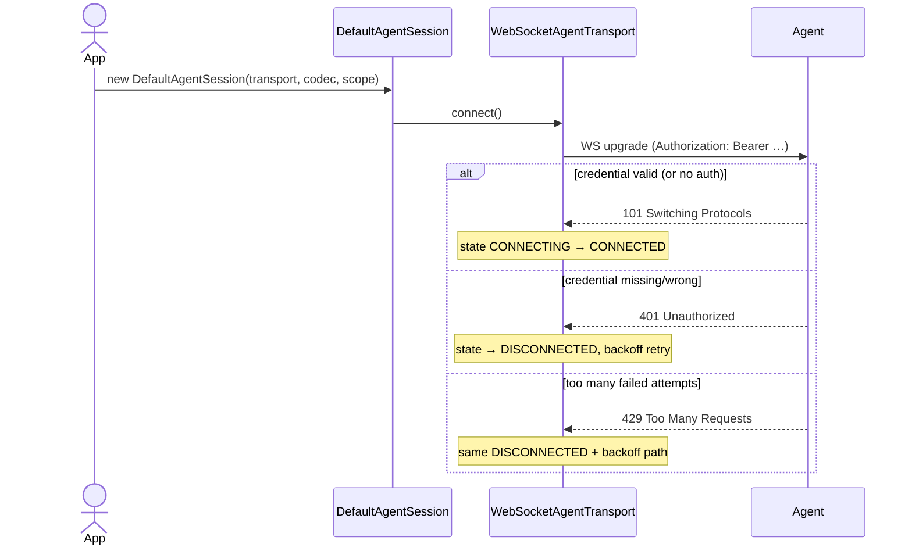
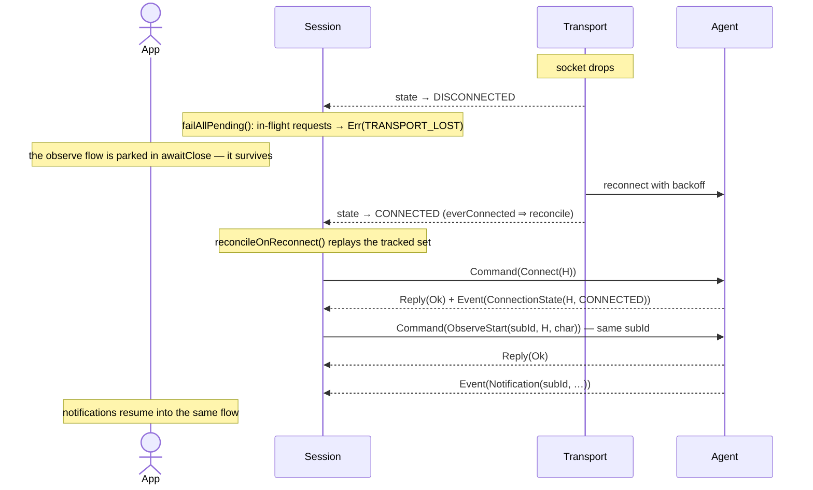
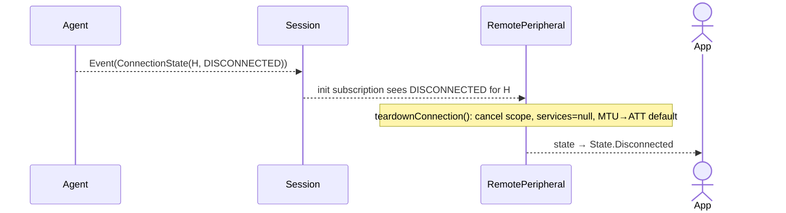

# End-to-End Flows

[← back to index](README.md)

These walkthroughs trace each operation across all three modules — what the app
calls, what crosses the wire, and what the agent does. They tie together
[protocol.md](protocol.md), [client-sdk.md](client-sdk.md), and [agent.md](agent.md).

Notation: `C→A` is a client→agent frame, `A→C` is agent→client.

---

## Real radio and simulation use the same wire flow

Every sequence below begins after the agent has selected a backend. With normal JVM startup it is
`EngineBleBackend`; with `--simulate <profile.json>` it is `SimulatedBleBackend`. That selection is
entirely behind `BleBackend`, so the WebSocket frames, client calls, session behavior, and diagrams
below do not change. [simulation.md](simulation.md) documents the profile contract and limits.

---

## Establishing a session



```
app: DefaultAgentSession(WebSocketAgentTransport("ws://host:8080/agent", …), CborProtocolCodec(), scope)
```

1. The session's `init` launches three coroutines: the decode loop (collects
   `transport.incoming`), the transport-state watcher, and a one-shot
   `transport.connect()`.
2. `WebSocketAgentTransport.connect()` opens the WS. `openSession()` first invokes the
   `authToken` provider (a `suspend () -> String?`, called once per attempt so a rotated
   token is picked up on reconnect); a non-null result is sent as `Authorization: Bearer
   <token>`. State: `DISCONNECTED → CONNECTING → CONNECTED`.
3. If auth fails, the agent returns `401` and the upgrade never completes →
   `openSession()` throws → state returns to `DISCONNECTED` → (if `ReconnectPolicy.enabled`)
   the backoff loop retries until connected or the policy gives up. A throwing `authToken`
   provider (e.g. a refresh failure) lands the same way. `request()` short-circuits to
   `Err(TRANSPORT_LOST)` while not CONNECTED (unless a `RetryPolicy` waits out the reconnect).
   Repeated wrong-credential attempts from one peer are rate-limited to `429` (the agent's
   fixed-memory `FailedAuthLimiter`); the client treats it identically to `401` — a failed upgrade
   that folds into the same backoff.

No frames cross the wire yet — the session is request-driven.

> **Logging:** The client SDK defaults silent (`Logger.level = null`). To turn on
> diagnostics, set `Logger.level = LogLevel.DEBUG` and `Logger.sink` before creating
> the session:
> ```kotlin
> Logger.sink = PrintlnSink   // or AndroidLogSink / AppleLogSink
> Logger.level = LogLevel.DEBUG
>```
> Flipping the level mid-session takes effect immediately (subsequent calls check
> `Logger.level` live). The agents default to `INFO` (set `REMOTE_BLE_LOG=debug` to
> override at startup; the Kotlin agent exposes the current level read-only at
> `GET /api/log-level`, operator-gated — management mutations are out of scope for 0.9.x).

---

## Scan

```mermaid
sequenceDiagram
    actor App
    participant Session
    participant Agent
    App->>Session: RemoteScanner(session).advertisements.collect
    Note over Session: scanId = nextStreamId(); pump filters ScanResult(scanId)
    Session->>Agent: Command(cid=1, ScanStart(scanId=1))
    Agent-->>Session: Reply(cid=1, Ok)
    loop until the collector is cancelled
        Agent-->>Session: Event(ScanResult(scanId=1, advertisement))
        Session-->>App: RemoteAdvertisement
    end
    App->>Session: cancel collection
    Session-)Agent: Command(cid=2, ScanStop(scanId=1))
```

```
app: RemoteScanner(session).advertisements.collect { … }   // or RemoteScanSource(session).advertisements()
```

```
            session.nextStreamId() → scanId = 1
  C→A   Command(cid=1, ScanStart(scanId=1, filters=[]))
  A→C   Reply(cid=1, Ok)                                   ← scan is now live
  A→C   Event(ScanResult(scanId=1, AdvertisementDto(device=…, name="HRM", rssi=-55)))
  A→C   Event(ScanResult(scanId=1, …))                     ← streams until cancel
            … on flow cancellation:
  C→A   Command(cid=2, ScanStop(scanId=1))                 ← fire-and-forget
```

- The `channelFlow` in `RemoteScanSource` launches the event pump (filtering
  `ScanResult` by `scanId=1`) **before** sending `ScanStart`, so no early result is
  missed.
- On the agent, `ScanStart` launches `backend.scan(filters)` and tags each
  `AdvertisementDto` with `scanId=1`. The real backend mints each `DeviceHandle` from
  the engine's scan result.
- Cancelling the collector triggers `awaitClose` → best-effort `ScanStop`.

`RemoteScanner` maps each `AdvertisementDto` into a Kable `RemoteAdvertisement`, whose
`handle` is the token for connecting.

---

## Connect (+ discover + MTU)

```
app: peripheral.connect()    // RemotePeripheral
```

```mermaid
sequenceDiagram
    actor App
    participant P as RemotePeripheral
    participant Session
    participant Agent
    participant Device
    App->>P: connect()
    Note over P: state = Connecting.Bluetooth
    P->>Session: Connect(H)
    Session->>Agent: Command(cid=3, Connect(H))
    Agent->>Device: native connect (slot reserved)
    Agent-->>Session: Reply(cid=3, Ok)
    Agent-->>Session: Event(ConnectionState(H, CONNECTED))
    Note over P: state = Connecting.Services
    P->>Session: Discover(H)
    Session->>Agent: Command(cid=4, Discover(H))
    Agent-->>Session: Reply(cid=4, Ok(Services[…]))
    Note over P: services mapped to Kable tree; state = Connecting.Observes
    P->>Session: RequestMtu(H, 247)
    Session->>Agent: Command(cid=5, RequestMtu(H, 247))
    Agent-->>Session: Reply(cid=5, Ok(Mtu(185)))
    Note over P: maxWrite = 185 − 3 = 182; state = Connected
```

`RemotePeripheral.connect()` walks Kable's `State` machine and issues three ops via
its `RemoteGattClient`:

```
  state = Connecting.Bluetooth
  C→A   Command(cid=3, Connect(device=H))                  timeout = RemoteTimeouts.connect (30s)
  A→C   Reply(cid=3, Ok)
  A→C   Event(ConnectionState(device=H, CONNECTED))        ← physical BLE link up
  state = Connecting.Services
  C→A   Command(cid=4, Discover(device=H))                 timeout = discover (20s)
  A→C   Reply(cid=4, Ok(Services([ServiceNode(…), …])))
            → services mapped to Kable DiscoveredService tree; peripheral.services set
  state = Connecting.Observes
  C→A   Command(cid=5, RequestMtu(device=H, mtu=247))      timeout = op (15s)
  A→C   Reply(cid=5, Ok(Mtu(185)))                         ← the negotiated value
            → maximumWriteValueLengthForType = 185 − 3 = 182
  state = Connected
```

- The agent's `Connect` reserves a slot under its mutex before the slow native
  connect; the cap is `maxConnections` (default 4) → `Err(NO_CONNECTION_SLOT)` past
  it.
- Discovery on the real backend polls until the GATT table stabilizes (see
  [agent.md](agent.md#op-by-op)).
- `RequestMtu` is wrapped in `runCatching` — a backend that doesn't support it leaves
  the ATT default (23) in place; connect still succeeds.
- The `ConnectionState(CONNECTED)` event is observed by `RemotePeripheral`'s `init`
  subscription but, since it's already driving its own state, it's informational here.
  Its real job is the *disconnect* path (below).

---

## Read

```
app: val value = peripheral.read(characteristic)
```

```
  C→A   Command(cid=6, Read(device=H, char=CharRef(service, characteristic)))
  A→C   Reply(cid=6, Ok(Bytes([0x42, 0x07])))
```

`RemoteGattClient.read` does `session.request(Read(…)).payloadAs<Bytes>().value`. On
the real backend, `read` triggers the native read and polls for a value whose
reference changed (the engine has no read-complete callback); on timeout the reply is
`Err(READ_FAILED)`, which `payloadAs`/`orThrow` raises as `AgentException` to the app.

---

## Write

```
app: peripheral.write(characteristic, data, WriteType.WithResponse)
```

```
  C→A   Command(cid=7, Write(device=H, char, value=data, withResponse=true))
  A→C   Reply(cid=7, Ok)                       ← or Err(WRITE_FAILED) if the radio rejected it
```

A `WRITE_FAILED` surfaces as `AgentException` but does **not** poison the session —
the next request proceeds normally (proven by
[`ErrorPathTest`](../client-sdk/src/jvmTest/kotlin/dev/warsha/remoteble/client/ErrorPathTest.kt)).
On the real backend the write is best-effort (no write-complete callback), so `Ok`
means "handed to the radio," not "acknowledged by the peer."

---

## Observe (notifications)

```mermaid
sequenceDiagram
    actor App
    participant Session
    participant Agent
    App->>Session: peripheral.observe(char).collect
    Note over Session: subId = nextStreamId(); pump filters Notification(subId)
    Session->>Agent: Command(cid=8, ObserveStart(subId, H, char))
    Agent-->>Session: Reply(cid=8, Ok)
    Note over Session: onSubscription() runs
    loop until the collector is cancelled
        Agent-->>Session: Event(Notification(subId, value))
        Session-->>App: value
    end
    App->>Session: cancel collection
    Session-)Agent: Command(cid=9, ObserveStop(subId))
```

```
app: peripheral.observe(characteristic).collect { value -> … }
```

```
            session.nextStreamId() → subId = 8
            [event pump for Notification(subId=8) launched]
  C→A   Command(cid=8, ObserveStart(subId=8, device=H, char))
  A→C   Reply(cid=8, Ok)                        ← subscription established; onSubscription() runs
  A→C   Event(Notification(subId=8, value=[…]))
  A→C   Event(Notification(subId=8, value=[…]))  ← streams until cancel
            … on flow cancellation:
  C→A   Command(cid=9, ObserveStop(subId=8))     ← fire-and-forget
```

The critical structural fact: **`ObserveStart` is sent once, on collect**; the flow
then parks in `awaitClose`, with the pump still filtering the session's shared event
flow by `subId=8`. This is what makes reconnection (below) work without app
involvement — and why the *session* (not the flow) must replay the subscription.

---

## Transport drop & reconcile-on-reconnect

Scenario: an active subscription exists (subId=8 on device H); the IP link drops and
comes back (e.g. the agent process restarts, losing all BLE state).



```
  … socket drops …
  transport.state → DISCONNECTED
      session.failAllPending()            ← any in-flight request() → Err(TRANSPORT_LOST)
      (the observe flow is NOT in-flight; it's parked in awaitClose — it survives)
  … WebSocketAgentTransport.reconnectWithBackoff(): CONNECTING → CONNECTED …
  transport.state → CONNECTED  (everConnected == true → reconcile)
      session.reconcileOnReconnect():
  C→A   Command(cid=10, Connect(device=H))            ← replay tracked connection
  A→C   Reply(cid=10, Ok)
  A→C   Event(ConnectionState(device=H, CONNECTED))
  C→A   Command(cid=11, ObserveStart(subId=8, H, char))   ← replay tracked subscription, SAME subId
  A→C   Reply(cid=11, Ok)
  A→C   Event(Notification(subId=8, …))               ← resumes into the still-collecting flow
```

Why it works:
- The session's *replay set* recorded `Connect(H)` and `ObserveStart(subId=8, …)` when
  they first succeeded (`trackForReplay`).
- On a CONNECTED-after-prior-connection transition it re-issues them with the
  **original `subId`**, and the fresh agent (empty state) starts streaming again.
- The app's `observe` flow never re-subscribed; its pump was filtering `subId=8` the
  whole time, so notifications simply resume.
- The replay set also carries the **last `SetConnParams` per device** (`lastConnParams`),
  replayed *right after* that device's `Connect` (params need a live link) and before its
  subscriptions — so a transport blip can't silently revert a peripheral to a
  battery-hungry connection interval. Like `Connect`/`ObserveStart`, it's idempotent on
  the agent. A device's params are dropped from the set when it's explicitly `Disconnect`ed.

Contrast — a device that was **explicitly disconnected** is *not* replayed: `Disconnect`
removed it (and its subscriptions) from the replay set, so a later reconnect leaves it
dark. (Proven by `disconnectedDeviceIsNotReplayedOnReconnect` in
[`WebSocketEndToEndTest`](../client-sdk/src/jvmTest/kotlin/dev/warsha/remoteble/client/WebSocketEndToEndTest.kt).)

If the agent had stayed alive (a brief network blip), the replayed `Connect` is
idempotent — the BLE link survived, so the agent replies `Ok` without re-emitting
`CONNECTED`, and the peripheral never sees a spurious disconnect. This is the whole
point of keeping the two state machines separate.

---

## Physical BLE disconnect (mid-session)

Scenario: the radio link drops (device out of range) while the IP link is fine. Today
this is driven by an explicit `Disconnect` (the agent has no unsolicited-drop channel
yet — see [agent.md](agent.md#op-handling)):



```
  A→C   Event(ConnectionState(device=H, DISCONNECTED))
      RemotePeripheral.init subscription sees DISCONNECTED for H, state != Disconnected →
          teardownConnection()  (cancel connection scope, clear services, reset MTU to ATT default)
          state = Disconnected
```

The app observing `peripheral.state` sees `State.Disconnected`, and `peripheral.services`
goes `null` — exactly as a local Kable peripheral would behave. (Proven by
`kablePeripheralReflectsAgentReportedDisconnect` in `ErrorPathTest`.)

---

## Request timeout

```
  C→A   Command(cid=12, Read(device=H, char))
        … no reply within the op timeout …
        withTimeoutOrNull → Err(TIMEOUT)        ← minted client-side; the pending slot is cleaned up
```

`TIMEOUT` (like `TRANSPORT_LOST`) is a client-side verdict — by definition the agent
didn't answer in time, so the agent can't have sent it. The per-op-class deadline
(`RemoteTimeouts`) decides how long "in time" is.
